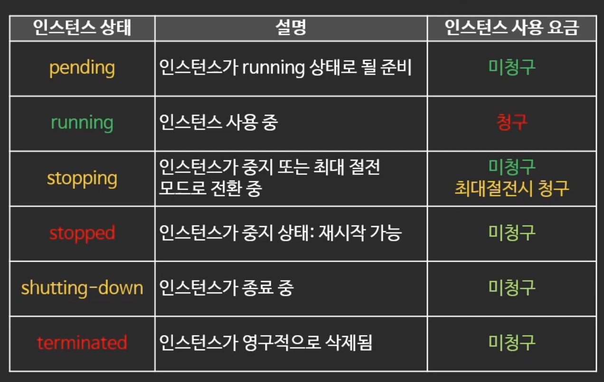

# EC2의 생명주기

- 중지
    - 중지 중에는 인스턴스 요금이 청구되지 않음.
    - 단 EBS 요금, 다른 구성요소는 청구됨
    - 중지 후 재시작시 퍼블릭 IP가 변경됨
    - EBS를 사용하는 인스턴스만 중지 가능

- 재부팅
    - 재부팅 시 퍼블릭 IP는 변경되지 않음.

- 최대 절전 모드
    - 완전한 종료와 비슷하지만 메모리 정보는 저장해서 재시작시 중단된 시점부터 시작가능.

