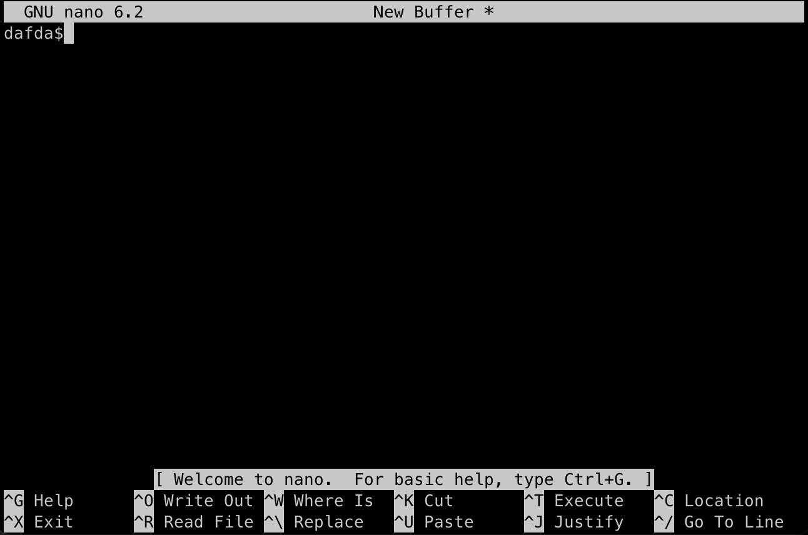
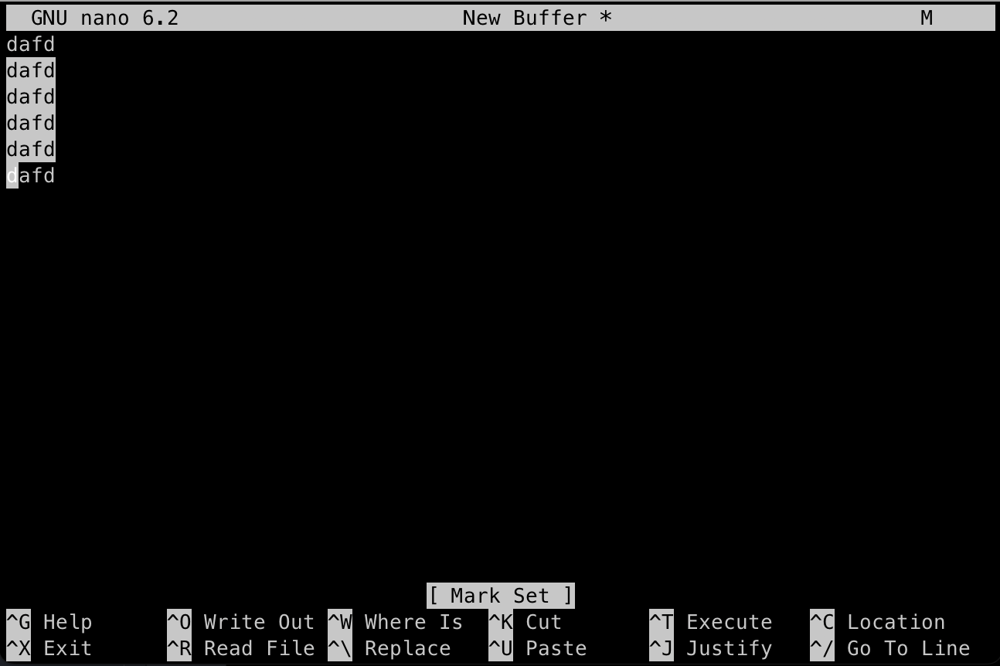
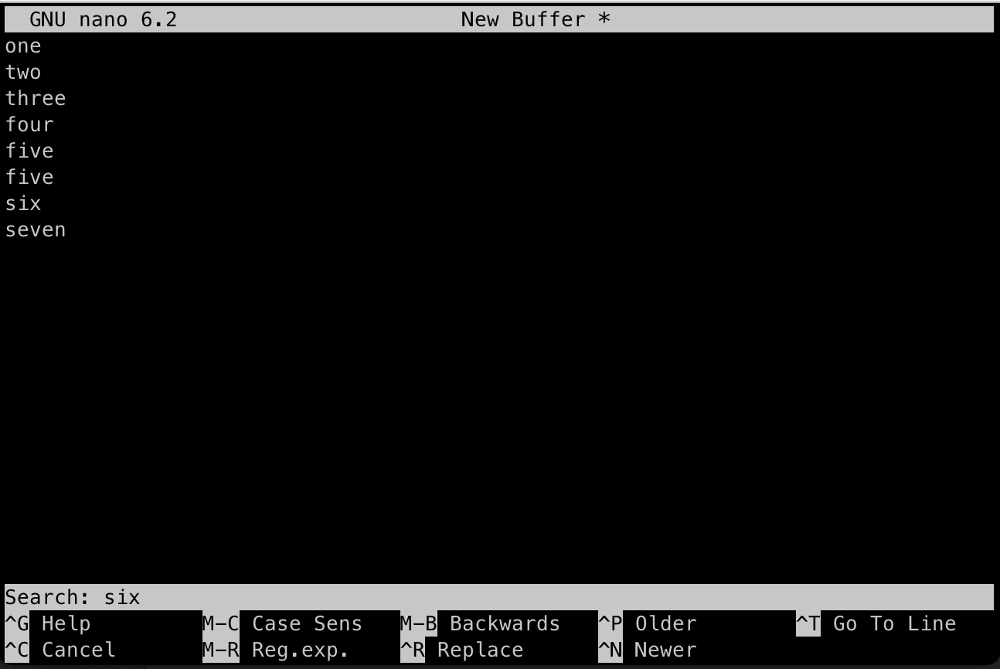
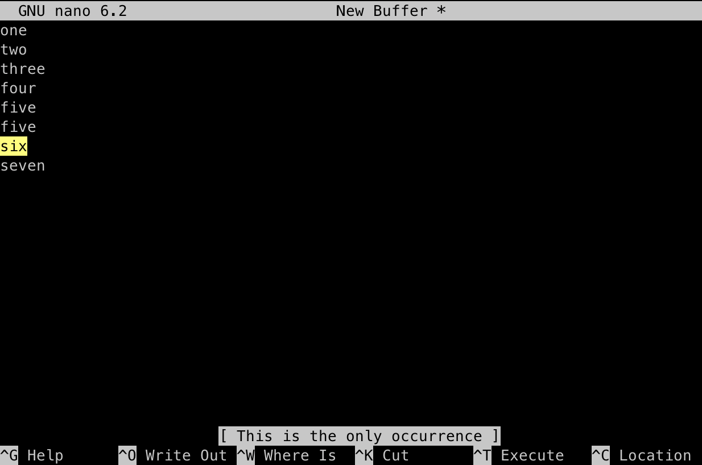
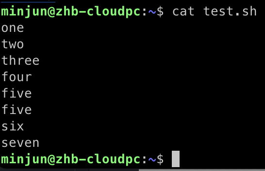

# nano Editor - Basics

```
$ (sudo) nano
또는
$ (sudo) nano 편집할_파일명
```

편집할 파일명을 입력하지 않을 경우 추후 저장할 때 파일명을 입력해야 하며, 저장 후 자동으로 파일이 생성됩니다.


Nano 편집기가 실행된 모습. 하단에는 간단한 단축키 목록이 표시되고 있다.
글씨를 입력해보자.



글씨를 입력하면 상단 바에 \*가 추가된것을 볼 수 있다. 또는 Modified가 추가되어 있을텐데,
이 파일이 수정되었다는 의미이다.

`Ctrl + K` 를 입력하면 라인 전체가 잘라지며, `Ctrl + U` 를 입력하면 붙여넣어진다.

한번에 여러줄을 잘라서, 붙여넣고 싶다면 `Ctrl + 6` 를 입력하고 방향키를 이용해 아래로 이동해보자.



[ Mark Set ] 이라는 글씨와 함께 선택된다. 해당 상태는 윈도우에서 마우스로 텍스트를 드래그해서 선택한것과 같다.
당연히 `Ctrl + K` 를 입력하면 잘라진다.

이번엔 본문 내 단어나 문장을 찾아보자.
`Ctrl + W` 를 입력하면 검색 모드로 진입된다.



Six 값을 입력하고 엔터를 쳐보자.



Six 글씨가 강조표시되며 자동으로 해당 문단으로 이동하게 된다.
이제 수정한 값을 저장해보자.

`Ctrl + O` 를 입력하면 저장 모드로 진입하게 된다.


초기에 Nano를 열 때 파일 이름을 지정해주지 않았기 때문에, 파일 이름을 입력하라고 나온다.
만약 초기에 파일 이름을 지정하였다면 수정 사항을 저장할것이냐고만 물어볼 것이다. 이때 Y나 N을 입력해주면 된다.
현재는 파일 이름을 입력하라고 나오기 때문에, `test.sh` 라는 이름을 입력하고 저장해보도록 하겠다.

저장하고 종료하려면 `Ctrl + X` 를 입력하면 된다. 만약 저장 없이 `Ctrl + X` 를 입력하게 된다면 저장할거냐고 물어보는 화면이 나오게 될것이다.

저장 후 `cat` 명령어로 잘 저장되었는지 확인해 보면..



잘 저장된것을 확인할 수 있다.
